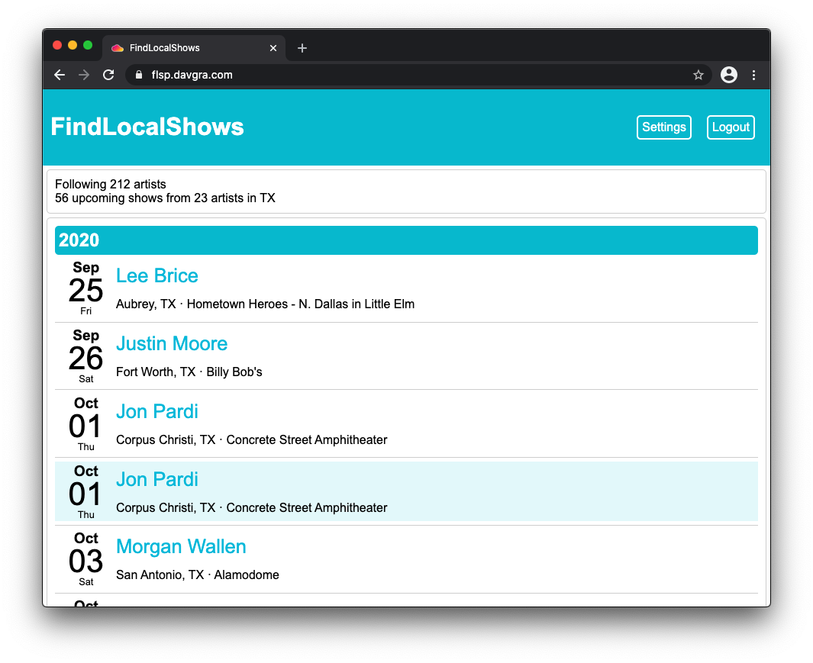

findlocalshows-perl
===================



FindLocalShows is a single-user web application for tracking upcoming shows from a list of artists. The main show list is public and shareable, while application settings are protected with authentication.

This implementation of FindLocalShows usies Perl and the Mojolicious web framework.

*NOTE: this application assumes deployment behind a reverse proxy that provides TLS.*

## Build

```bash
docker-compose -f docker-compose.dgserv3.flsp.yaml build
```

## Deploy

```bash
# configure findlocalshows-perl
cp config.example.env config.env
vim config.env

# deploy containers
docker-compose -f docker-compose.dgserv3.flsp.yaml up -d
```

## Usage

### Initial Setup


When first deployed, FindLocalShows will ask for a username/password for the primary user.


Once credentials are entered, you are redirected to the main show list page. Login is required for further configuration.

### Add Artists to Follow


After logging in, the Settings page becomes available in the upper-right corner.


Clicking Settings brings us to the settings page, where a default region can be selected, and followed artists can be added or removed.

### View Upcoming Shows


After everything is configured, the main shows list provides a quick glance at upcoming shows for a particular state. Use the region selector to view other states, and share the url to whoever may be interested!
